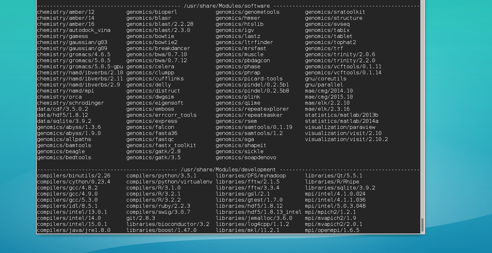

> ## Learning Objectives {.objectives}
>
> * Understand the need for a dynamic environment
> * Learn to load and unload modulefiles
> * Learn to write your own modulefiles

## Pre-installed Modulefiles

List available modulefiles

~~~ {.bash}
$ module avail
~~~

Load a Modulefile

~~~ {.bash}
$ python3
~~~
~~~ {.output}
-bash: python3: command not found
~~~

~~~ {.bash}
$ module load compilers/python/3.5.1
$ module list
~~~
~~~ {.output}
Currently Loaded Modulefiles:
	1) compilers/python/3.5.1
~~~

~~~ {.bash}
$ python3
~~~
~~~ {.output}
Python 3.5.1 (default, Mar 10 2016, 10:56:02) [GCC 4.4.7 20120313 (Red Hat 
4.4.7-16)] on linux
Type "help", "copyright", "credits" or "license" for more information.
>>> 
~~~

Unload a Modulefile

~~~ {.bash}
$ module unload compilers/python/3.5.1
$ module list
~~~
~~~ {.output}
No Modulefiles Currently Loaded.
~~~
~~~ {.bash}
$ python3
~~~
~~~ {.output}
-bash: python3: command not found
~~~

### Search for Modulefiles

By Category

~~~ {.bash}
$ module avail mpi
~~~
~~~ {.output}
--------------- /usr/share/Modules/development ------------------------------------
mpi/intel/4.1.0.024 mpi/intel/5.0.3.048 mpi/mvapich2/1.9    mpi/openmpi/1.6.5
mpi/intel/4.1.1.036 mpi/mpich2/1.2.1    mpi/mvapich2/2.0.1  mpi/openmpi/1.8.4
~~~

### What Modulefiles look like

~~~ {.bash}
$ module show compilers/python/3.5.1
~~~
~~~ {.output}
-------------------------------------------------------------------
/usr/share/Modules/development/compilers/python/3.5.1:

module-whatis	 Name: Python 
module-whatis	 Version: 3.5.1 
module-whatis	 Category: Scripting Language Intrepeter 
module-whatis	 URL: http://www.python.org 
module-whatis	 packages: setuptools-18.2 
conflict	     compilers/python/2.7.3 compilers/python/2.7.10 
prepend-path	 PATH /shared/software/python/python-3.5.1/bin 
-------------------------------------------------------------------
~~~

What is command

~~~ {.bash}
$ module whatis compilers/python/3.5.1
~~~
~~~ {.output}
compilers/python/3.5.1: Name: Python
compilers/python/3.5.1: Version: 3.5.1
compilers/python/3.5.1: Category: Scripting Language Intrepeter
compilers/python/3.5.1: URL: http://www.python.org
compilers/python/3.5.1: packages: setuptools-18.2
~~~

### Internal search of modulefiles

~~~ {.bash}
$ module apropos -i setuptools
~~~
~~~ {.output}
compilers/python/2.7.10: packages: Numpy 1.9.2, Matplotlib 1.4.3, Setuptools 18.3.1
compilers/python/3.5.1: packages: setuptools-18.2
~~~

## Writing private module files

Modulefiles can be written by users so they can control their own environments.  
Modulefiles are very simple to write.  Usually, you just want to add a 
directory to your `PATH` variable.  We want to write a modulefile to use our 
python3 interpreter; which consists of adding `$HOME/python3/bin` to our `PATH` 
variable.  This is done with the `prepend-path` directive in modulefiles.

~~~ {.bash}
$ cat python3
~~~
~~~ {.output}
#%Module

prepend-path PATH /home/training01/python3/bin
~~~

Personal modulefiles need to be located in a subdirectory `privatemodules` in 
your home directory.

Load your personal private modulefiles

~~~ {.bash}
$ module load use.own
~~~

You can now see your personal modulefiles in the `module avail` command.

~~~ {.bash}
$ module avail
~~~
~~~ {.output}
---------------------- /home/training01/privatemodules -------------------------------
python3
~~~

We can load the python3 modulefile, and verify that it works correctly.

~~~ {.bash}
$ python3
~~~
~~~ {.output}
-bash3: python3: command not found
~~~
~~~ {.bash}
$ module load python3
$ module list
~~~
~~~ {.output}
Currently Loaded Modulefiles:
  1) use.own   2) python3
~~~
~~~ {.bash}
$ which python3
~~~
~~~ {.output}
/home/training01/python3/bin/python3
~~~

