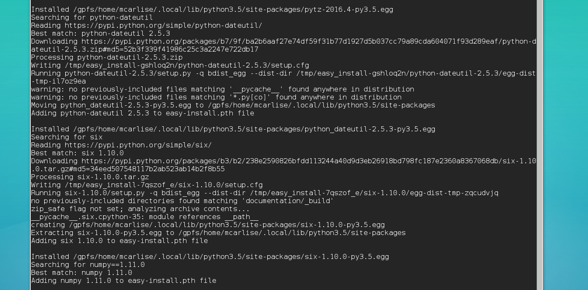

> ## Learning Objectives {.objectives}
>
> * Learn to install python modules
> * Install a python module using pip
> * Install a python module using setup.py

## Install Numpy with pip

~~~ {.bash}
$ pip3 install --user numpy
~~~
~~~ {.output}
Collecting numpy
  Downloading numpy-1.11.0.tar.gz (4.2MB)
4.2MB 135kB/s Installing collected packages: numpy
  Running setup.py install for numpy

Successfully installed numpy
~~~

## Install Matplotlib using setup.py

[Matplotlib github release page](https://github.com/matplotlib/matplotlib/releases)

Unpack the tarball
~~~ {.bash}
$ tar xzvf matplotlib-1.5.1.tar.gz
$ cd matplotlib
$ ls
~~~
~~~ {.output}
CHANGELOG        Makefile             doc         matplotlibrc.template  src           unit
CONTRIBUTING.md  README.osx           examples    release                test_only.py  versioneer.py
INSTALL          README.rst           extern      setup.cfg.template     tests.py
LICENSE          boilerplate.py       lib         setup.py               tools
MANIFEST.in      distribute_setup.py  license.py  setupext.py            
tox.ini
~~~

Build the package

~~~ {.bash}
$ module load python3
$ python3 setup.py build
~~~

Install the package

~~~ {.bash}
$ python3 setup.py install --user
~~~

## Try running the python script

~~~ {.bash}
$ ./random-sample.py
~~~
~~~ {.output}
Traceback (most recent call last):
  File "./random-sample.py", line 4, in <module>
	import matplotlib.pyplot as plt
ImportError: No module named matplotlib.pyplot
~~~

But you already installed matplotlib?  Need to check which python interpreter 
the script is calling

~~~ {.bash}
$ nano random-sample.py
~~~

Change the first line to '#!/usr/bin python3'.

~~~ {.bash}
$ ./random-sample.py
~~~

